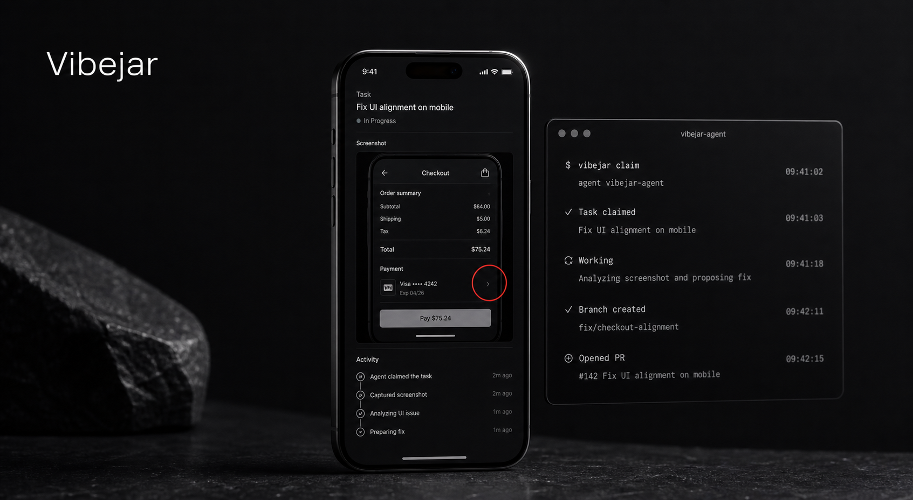

<p align="center">
  
</p>

**Vibejar agent** is the open MIT surface for [Vibejar](https://vibejar.com): CLI + Agent Skill + protocol so Claude Code, Codex, Cursor, and friends can claim screenshot bugs from a jar, ship a fix, and report proof.

The capture app is paid — **$88 once**, forever. Everything your agent touches in this repo stays free and open. No subscription, no seats, no open-core upsell.

<p align="center">
  <a href="https://vibejar.com"><strong>Get the app</strong></a>
  ·
  <a href="https://vibejar.com/connect.md"><strong>Connect an agent</strong></a>
  · MIT · Claude Code · Codex · Cursor · Grok
</p>

## What it does

- **Phone captures the bug.** Circle what’s wrong in the app; it lands in a jar.
- **Agent works the queue.** `list` open captures, `claim` one, fix from the annotated shot, open a PR, mark status.
- **One install for every agent.** CLI + [Agent Skills](https://agentskills.io) skill (Claude / Grok / Codex / Cursor discovery paths).
- **Stable contract.** Commands and shapes don’t thrash — see [`contract.md`](./contract.md).
- **Self-updating.** `self-update` re-pulls CLI + skill from vibejar.com so sessions stay current.

## Install

One shot (recommended):

```sh
curl -fsSL https://vibejar.com/install.sh | bash
```

That installs:

| What | Path |
|------|------|
| CLI | `~/.vibejar/cli.ts` |
| Skill (canonical) | `~/.agents/skills/vibejar/SKILL.md` |
| Symlinks | Claude / Grok / Codex / Cursor skill dirs when present |

Requires [bun](https://bun.sh) — the installer adds it if missing.

Verify:

```sh
bun ~/.vibejar/cli.ts whoami
```

Update any time:

```sh
bun ~/.vibejar/cli.ts self-update
# or
curl -fsSL https://vibejar.com/install.sh | bash -s -- --update
```

Point an agent at setup with:

```text
Read https://vibejar.com/connect.md and set up Vibejar.
```

## Pair with the phone app

In the app, open pair mode, then:

```sh
bun ~/.vibejar/cli.ts pair <token> --name "Claude Code"
```

Or use a shared jar link (`https://vibejar.com/j/<slug>`) — `fork` mints an identity with no pair step.

## Working a jar

```sh
bun ~/.vibejar/cli.ts self-update   # once per session
bun ~/.vibejar/cli.ts jars
bun ~/.vibejar/cli.ts list [jar]
bun ~/.vibejar/cli.ts claim <id>    # note + local screenshot path
# fix in the right repo, open one PR
bun ~/.vibejar/cli.ts status <id> review --pr <url>
```

Rules that matter:

1. **List first, claim second** — never batch-claim blind.
2. **One claim at a time** — the one you’re fixing now.
3. **Image first** — the annotated screenshot is ground truth.
4. **One PR per fix** — don’t bag unrelated captures.
5. Mistaken claim → `status <id> todo` immediately.

Full agent rules live in [`skill/SKILL.md`](./skill/SKILL.md). Human-oriented setup: [connect.md](./connect.md) / [vibejar.com/connect.md](https://vibejar.com/connect.md).

## Open vs closed

| Open (MIT, this repo) | Closed |
|----------------------|--------|
| CLI (`cli.ts`) | iOS / Android capture app |
| Agent skill | Landing site |
| Protocol (`contract.md`) | Jar backend / cloud |
| Installer (`install.sh`) | App Store / RevenueCat billing |

Same shape as Sublime Text or Alfred for years: **you buy the tool, the ecosystem around it stays open.**

## Pricing

**$88 one-time** for the capture app. Forever unlock. No subscription.

The agent integration is free so every coding agent can work jars without friction. Buy: [vibejar.com](https://vibejar.com).

## Repo layout

```
cli.ts           # agent CLI (also served at vibejar.com/cli.ts)
install.sh       # one-shot installer
skill/SKILL.md   # Agent Skills package
contract.md      # stable CLI + jar contract
connect.md       # setup doc for humans and agents
examples/        # sample workflows
assets/hero.png  # README cover
```

Production install always pulls from `https://vibejar.com` so self-update stays simple. This GitHub repo is the **reviewable source** of the agent surface.

## From this clone (optional)

```sh
git clone https://github.com/johnkueh/vibejar-agent.git
cd vibejar-agent
# end users should still use the production installer:
curl -fsSL https://vibejar.com/install.sh | bash
```

## Contributing

PRs welcome on the **agent surface** only (CLI, skill, protocol docs, examples). Keep the command shapes in `contract.md` stable. App and backend live in a private monorepo — don’t open PRs against App Store / paywall / cloud here.

See [CONTRIBUTING.md](./CONTRIBUTING.md).

## More

- App & marketing: [vibejar.com](https://vibejar.com)
- Connect: [vibejar.com/connect.md](https://vibejar.com/connect.md)
- Vibe debugging guide: [vibejar.com/guides/vibe-debugging](https://vibejar.com/guides/vibe-debugging)
- Claude Code plugins roundup: [vibejar.com/best/claude-code-plugins](https://vibejar.com/best/claude-code-plugins)

## Privacy / network

The CLI talks to Vibejar’s backend (resolved via `https://vibejar.com/.well-known/vibejar.json`), downloads claim screenshots, and can re-fetch itself on `self-update`. Credentials live at `~/.config/vibejar/token` (mode 0600). See the security note at the top of `cli.ts`.

## License

[MIT](./LICENSE) © 2026 John Kueh / Vibejar
